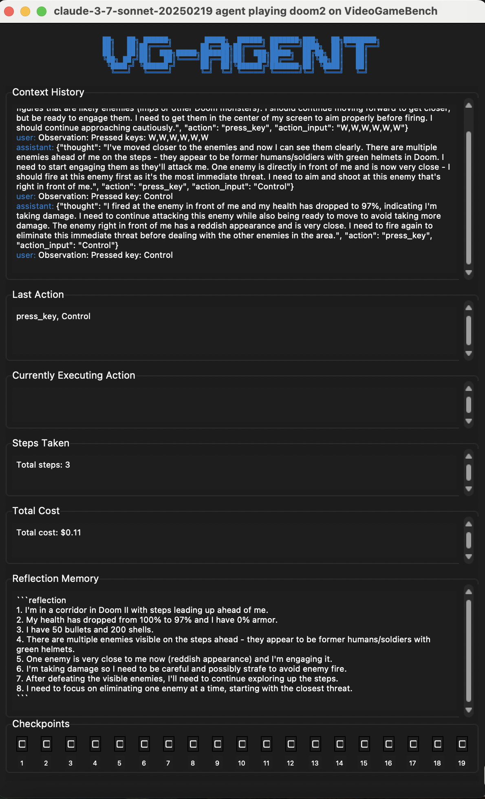

<div align="center">


</div>
<div align="center">
  
[](https://www.vgbench.com)
[](https://arxiv.org/abs/2505.18134)

</div>

<p align="center">
  
</p>

---

# VideoGameBench: Benchmarking Video Games for VLMs
**VideoGameBench** is an evaluation benchmark for evaluating Vision-Language Models (VLMs) **multi-modal** understanding + reasoning on well-known video games. It currently supports Game Boy (through [PyBoy](https://github.com/Baekalfen/PyBoy)), MS-DOS (through [JS-DOS](https://js-dos.com/overview.html)), and browser games, providing a standardized way to evaluate LLM performance in game understanding and interaction.

For mouse + keyboard games, we also provide a simple interface for helping the model generically / properly click on positions on the screen. We provide some example trajectories below of the model playing these games **real-time**, i.e. the model calls are async with respect to the game.

## Installation

```bash
conda create -n videogamebench python=3.10
conda activate videogamebench
pip install -r requirements.txt
pip install -e .  
playwright install # Install playwright for DOS games
```

## Quick Start
### Running Game Boy Games (Gameboy Emulator)
Once you've downloaded and placed the appropriate ROMs into the `roms/` folder (for expected names, see `src/consts.py`). We provide a simple VideoGameAgent for Game Boy games which you can run below:

```bash
# Run with a Game Boy ROM file
python main.py --game pokemon_red --model gpt-4o

```

### Running DOS Games (Mouse + Keyboard)
DOS games are loaded with `js-dos` and do not require downloading games. We provide a simple VideoGameAgent for DOS games which you can run below:

```bash
# Run Doom2 with Gemini 2.5 Pro
python main.py --game doom2 --model gemini/gemini-2.5-pro-preview-03-25

# Run CIV with claude 3-7 and the agent state UI side by side
python main.py --game civ --model anthropic/claude-3-7-sonnet-20250219 --enable-ui

# Run Warcraft 2 in lite mode, so game pauses while model thinks
python main.py --game warcraft2 --model together_ai/meta-llama/Llama-4-Maverick-17B-128E-Instruct-FP8 --enable-ui

# Run website-only mode to play the game yourself
python main.py --game quake --website-only
```

### Running Lite Games
Running games on VideoGameBench Lite is the same as running on the regular benchmark, just with the `--lite` flag. For example,

```bash
python main.py --game doom2 --model gemini/gemini-2.5-pro-preview-03-25 --lite
```

You can specify a model name with `--model` (according to [LiteLLM](https://github.com/BerriAI/litellm) naming, which is very intuitive -- e.g. Gemini 2.0 Flash is `gemini/gemini-2.0-flash`) which will draw from your environment variables and/or `.env`, but you can specify particular keys with `--api-key`. Each game will also have an associated config with defaults in the `configs/` folder.

**For local models with Ollama**: You can also specify an `api_base` with `--api-base` for models like Ollama, which works with LiteLLM. See more details at [https://docs.litellm.ai/docs/providers/ollama](https://docs.litellm.ai/docs/providers/ollama).

```bash
# First start ollama server

python main.py --game kirby --model ollama/llama2 --api-base http://localhost:11434 --enable-ui
```

We also provide a GUI with `tkinter` to view the agent's actions, thoughts, memory, etc. with `--enable-ui`:

<p align="center">
  
</p>

### Replicating Paper Experiments
We've run each of the following models:
* `gemini/gemini-2-5.pro-preview-03-25` (we also use `--max-tokens 2048`)
* `gemini/gemini-2.0-flash` (we also use `--max-tokens 2048`)
* `llama4` (actual model is `Llama-4-Maverick-17B-128E-Instruct-FP8`, we also use `max-context-size 8` so it does not go over the context window limit)
* `gpt-4o` (actual model is `gpt-4o-2024-08-06`)
* `claude-3.7` (actual model is `claude-3-7-sonnet-20250219`)

We provide a list of scripts run in `all_experiments.sh`.

## Credit to Emulators, Platforms, etc.
We want to be clear on what we built and what we build on top of! Our benchmark relies heavily on [PyBoy](https://github.com/Baekalfen/PyBoy) for a Gym-based Game Boy emulator, [JS-DOS](https://js-dos.com/overview.html) for MS-DOS games, and [Playwright](https://playwright.dev/) for interacting with browser-based games. We also use [LiteLLM](https://docs.litellm.ai/docs/) for handling models, so you can use run almost any frontier VLM API! You will need to provide your own API keys.

## VideoGameBench: List of Games
The codebase easily supports more MS-DOS and GameBoy games, but we fix a diverse set of games for evaluation purposes. The games relevant to **VideoGameBench** are below:

<p align="center">
  
</p>

### VideoGameBench `test` set games
1. [3D] [shooter] Doom II
2. [2D] [grid-world] [turn-based] Pokemon Crystal (GBC)
3. [2D] [open-world] Legend of Zelda: Link's Awakening (DX for GBC)
4. [2D] [strategy] [turn-based] Sid Meier's Civilization 1
5. [3D] [racer] The Need for Speed
6. [2D] [platformer] Kirby's Dream Land (DX for GBC)
7. [2D] [puzzle] The Incredible Machine (1993)

### VideoGameBench `dev` set games
DOS Games:
1. [3D] [shooter] Doom
2. [3D] [shooter] Quake
3. [2.5D] [strategy] Warcraft II: Tides of Darkness (Orc Campaign)
4. [2D] [strategy] [turn-based] Oregon Trail Deluxe (1992)
5. [2D] [strategy] X-COM UFO Defense
6. [2D] [platformer] Prince of Persia
7. [2D] [strategy] Age of Empires (1997)

Game Boy Games:
1. [2D] [grid-world] [turn-based] Pokemon Red (GB)
2. [2D] [platformer] Super Mario Land
3. [2D] [platformer] Mega Man: Dr. Wily's Revenge
4. [2D] [platformer] Donkey Kong Land 2
5. [2D] [platformer] Castlevania Adventure
6. [2D] [detective] Scooby-Doo! - Classic Creep Capers 


## Game-specific Configurations and Adding new Games
Each game has its own associated config in the `configs/` folder, which controls a few settings about each game (currently very few). Each game has a folder under its name, e.g. `configs/game/` with a `config.yaml` and some optional files that the code looks for:
* The most important other file is the `prompt.txt`, which is the game-specific prompt that gets fed to the model at every step. You can update this with whatever game specific information you want to provide to help the agent.
* For tracking "end-states", you can add to a folder called `checkpoints/` inside the `configs/{game}` folder. Here, you can add as many checkpoints as you want, named by number (e.g. `1.png`). The last checkpoint in numerical order is considered the `end state`, and signals a complete game. See 
* For DOS games there is the ability to use a custom HTML template for your own JS-DOS games. This allows modifying the website with your own tools and frameworks for your agents to aid them in playing the game. If you specify a `game.html` and a `dos` game in the config, it will override the default `JS-DOS` html.
* For DOS games, if you want the game to load a set of actions beforehand, you can fill a `preload.txt` out with actions and delays. See `src/browser_controller.py` for how this is controlled. This is useful because a lot of DOS games have difficulty selection menus which you may want to fix.

To **add new games**, in addition to make a config above, you also have to edit the `src/consts.py` file. For GB games edit the `ROM_FILE_MAP` to map a game name for the `--game` flag to the name of the ROM that you put in the `roms/` folder, and for DOS games update the JSDOS file link in the `GAME_URL_MAP`.

## Basic codebase navigation
We mostly separate out the codebase by the evaluators (which run the episode) and the agent logic. It's relatively simple to edit, and we are working on making it more robust.

```
src/
├── evaluator.py          # Main evaluation loop and episode management
├── run_dos.py            # DOS-specific game runner
├── run_gb.py             # Game Boy-specific emulator runner
├── emulators/            
│   ├── dos/              # DOS-specific emulator logic
│   ├── gba/              # Game Boy-specific emulator logic
│   ├── interface_base.py # Base interface class for emulators
├── llm/                  # Folder for LLM and Agent logic.
├──── llm_client.py       # LLMLite logic
├──── vgagent.py          # VG-Agent logic for both GB and DOS
main.py                   # Entrypoint for launching VideoGameBench
```

## Command Line Options
We provide a shorter list of the relevant command line arguments for replicating experiments. The full set of arguments (provided for added flexibility) are found in `main.py`.
```
Common options:
  --emulator {dos,gba}    Which emulator to use (default: none)
  --game GAME             Picks a game from the configs list
  --lite                  Enable lite mode for the game, meaning pause enabled while model is thinking
  --model MODEL           The VLM model to use (using LiteLLM syntax). Defaults to gpt-4o
  --enable-ui             Run the game with the agent UI enabled
  --max-steps MAX_STEPS   Maximum number of steps to run. Defaults to 15000

DOS-specific options:
  --website-only           Just open the website without agent interaction
```

## Logging

The system creates comprehensive logs for each session including:
- Screenshot images at each step (found in `game_screen/` or `lite_screenshots` for lite games.)
- Screenshot images for agent UI (found in `monitor/`)
- LLM API interactions, button presses, game state information
- Model reflections / internal memory

Logs are stored in the `logs/{game}/{model}/{run}` directory with timestamps.


## Generating Videos / Clips

There are two main ways to generate videos / clips from VideoGameBench. The first is to just
record the screen as it plays (best for streaming). The second is to use the frames provided to
the model to generate a video using OpenCV, which we used to generate on our website. We provide
a Python notebook to generate these videos from saved frames for both MS-DOS and Game Boy games in
the `notebooks/generate_clips.ipynb` file.

## License
**Disclaimer**: While all parts of this codebase fall under the MIT license (i.e. free use for both personal and commercial purposes), the **games** themselves do not. You must legally own the games to play them.
