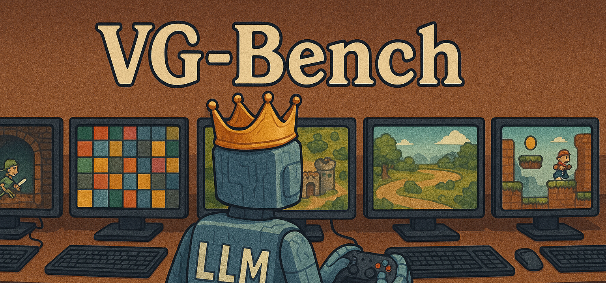
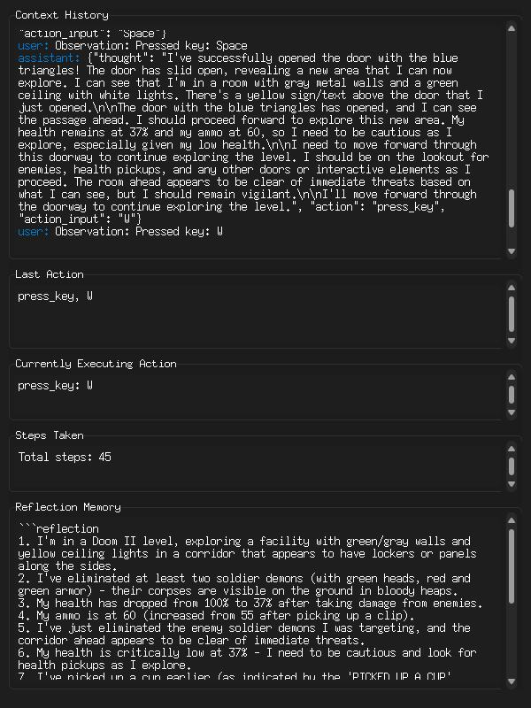

# VideoGameBench: Benchmarking Video Games for VLMs
<p align="center">
  
</p>

Research Preview Website / Blogpost: [vgbench.com](https://www.vgbench.com)

**VideoGameBench** is an evaluation benchmark for evaluating Vision-Language Models (VLMs) **multi-modal** understanding + reasoning on well-known video games. It currently supports Game Boy (through [PyBoy](https://github.com/Baekalfen/PyBoy)), MS-DOS (through [JS-DOS](https://js-dos.com/overview.html)), and browser games, providing a standardized way to evaluate LLM performance in game understanding and interaction.

For mouse + keyboard games, we also provide a simple interface for helping the model generically / properly click on positions on the screen. We provide some example trajectories below of the model playing these games **real-time**, i.e. the model calls are async with respect to the game.

## Installation

```bash
conda create -n videogamebench python=3.10
conda activate videogamebench
pip install -r requirements.txt
pip install -e .  
playwright install # Install playwright for DOS games
```

## Quick Start

### Running Game Boy Games (Gameboy Emulator)
Once you've downloaded and placed the appropriate ROMs into the `roms/` folder (for expected names, see `src/consts.py`). We provide a simple VideoGameAgent for Game Boy games which you can run below:

```bash
# Run with a Game Boy ROM file
python main.py --game pokemon_red --model gpt-4o

```

### Running DOS Games (Mouse + Keyboard)
DOS games are loaded with `js-dos` and do not requiring downloading games. We provide a simple VideoGameAgent for DOS games which you can run below:

```bash
# Run Doom2 with Gemini 2.5 Pro
python main.py --game doom2 --model gemini/gemini-2.5-pro-preview-03-25

# Run CIV with claude 3-7 and the agent state UI side by side
python main.py --game civ --model anthropic/claude-3-7-sonnet-20250219 --enable-ui

# Run Warcraft 2 in lite mode, so game pauses while model thinks
python main.py --game warcraft2 --model anthropic/claude-3-7-sonnet-20250219 --enable-ui

# Run website-only mode to play the game yourself
python main.py --game quake --website-only
```

You can specify a model name with `--model` (according to [LiteLLM](https://github.com/BerriAI/litellm) naming, which is very intuitive -- e.g. Gemini 2.0 Flash is `gemini/gemini-2.0-flash`) which will draw from your environment variables and/or `.env`, but you can specify particular keys with `--api-key`. Each game will also have an associated config with defaults in the `configs/` folder.

We also provide a GUI with `tkinter` to view the agent's actions, thoughts, memory, etc. with `--enable-ui`:

<p align="center">
  
</p>


## Credit to Emulators, Platforms, etc.
We want to be clear on what we built and what we build on top of! Our benchmark relies heavily on [PyBoy](https://github.com/Baekalfen/PyBoy) for a Gym-based Game Boy emulator, [JS-DOS](https://js-dos.com/overview.html) for MS-DOS games, and [Playwright](https://playwright.dev/) for interacting with browser-based games. We also use [LiteLLM](https://docs.litellm.ai/docs/) for handling models, so you can use run almost any frontier VLM API! You will need to provide your own API keys.

## VideoGameBench: List of Games
The codebase easily supports more MS-DOS and GameBoy games, but we fix a diverse set of games for evaluation purposes. The games relevant to **VideoGameBench** are below:

<p align="center">
  
</p>

### DOS Games
1. [3D] [shooter] Doom
2. [3D] [shooter] Doom II
3. [3D] [shooter] Quake
4. [2D] [strategy] [turn-based] Sid Meier’s Civilization 1
5. [2.5D] [strategy] Warcraft II: Tides of Darkness (Orc Campaign)
6. [2D] [strategy] [turn-based] Oregon Trail Deluxe (1992)
7. [2D] [strategy] X-COM UFO Defense
8. [2D] [puzzle] The Incredible Machine (1993)
9. [2D] [platformer] Prince of Persia
10. [3D] [racer] The Need for Speed
11. [2D] [strategy] Age of Empires (1997)

### Game Boy Games
1. [2D] [grid-world] [turn-based] Pokemon Red (GB)
2. [2D] [grid-world] [turn-based] Pokemon Crystal (GBC)
3. [2D] [open-world] Legend of Zelda: Link’s Awakening (DX for GBC)
4. [2D] [platformer] Super Mario Land
5. [2D] [platformer] Kirby’s Dream Land (DX for GBC)
6. [2D] [platformer] Mega Man: Dr. Wily’s Revenge
7. [2D] [platformer] Donkey Kong Land 2
8. [2D] [platformer] Castlevania Adventure
8. [2D] [detective] Scooby-Doo! - Classic Creep Capers 


## Game-specific Configurations and Adding new Games
Each game has its own associated config in the `configs/` folder, which controls a few settings about each game (currently very few). Each game has a folder under its name, e.g. `configs/game/` with a `config.yaml` and some optional files that the code looks for:
* The most important other file is the `prompt.txt`, which is the game-specific prompt that gets fed to the model at every step. You can update this with whatever game specific information you want to provide to help the agent.
* For DOS games there is the ability to use a custom HTML template for your own JS-DOS games. This allows modifying the website with your own tools and frameworks for your agents to aid them in playing the game. If you specify a `game.html` and a `dos` game in the config, it will override the default `JS-DOS` html.
* For DOS games, if you want the game to load a set of actions beforehand, you can fill a `preload.txt` out with actions and delays. See `src/browser_controller.py` for how this is controlled. This is useful because a lot of DOS games have difficulty selection menus which you may want to fix.

To **add new games**, in addition to make a config above, you also have to edit the `src/consts.py` file. For GB games edit the `ROM_FILE_MAP` to map a game name for the `--game` flag to the name of the ROM that you put in the `roms/` folder, and for DOS games update the JSDOS file link in the `GAME_URL_MAP`.

## Basic codebase navigation
We mostly separate out the codebase by the evaluators (which run the episode) and the agent logic. It's relatively simple to edit, and we are working on making it more robust.

```
src/
├── evaluator.py # Main evaluation loop and episode management
├── run_dos.py # DOS-specific game runner and browser control
├── run_gb.py # Game Boy-specific emulator runner
├── llm/ # LLM and Agent logic.
├──── llm_client.py # LLMLite logic
├──── realtime_agent.py # Agent logic for both GB and DOS
main.py # Main file
```

## Command Line Options

```
Common options:
  --emulator {dos,gba}    Which emulator to use (default: none)
  --game GAME             Picks a game from the configs list.
  --model MODEL           The VLM model to use. Defaults to gpt-4o
  --temperature FLOAT     Temperature for VLM generations. Defaults to 0.7
  --max-tokens  INT       Max # output tokens for VLM generations per step. Defaults to 1024
  --api-key API_KEY       API key for the chosen LLM provider (not needed if env variable present)
  --headless              Run the emulator without visual display
  --enable-ui             Run the game with the agent UI enabled.
  --lite                  Enable lite mode for the game, meaning pause enabled while model is thinking

GBA-specific options:
  --max-steps MAX_STEPS      Maximum number of steps to run
  --step-delay STEP_DELAY    Delay between steps in seconds
  --skip-frames SKIP_FRAMES  Number of frames to skip per step
  --fake-actions             Use random actions instead of calling the LLM
  --history-tokens TOKENS    Maximum number of tokens in conversation history

DOS-specific options:
  --website-only          Just open the website without agent interaction
```


## Logging

The system creates comprehensive logs for each session including:
- Screenshot images at each step
- LLM API interactions, button presses, game state information
- Model reflections / internal memory

Logs are stored in the `logs/{game}/{model}/{run}` directory with timestamps.

## Example Agent Trajectories

**ReACT Agent with Memory (GPT 4o) playing CIV 1 and mistakenly choosing to reject peace:**
<p align="center">
  
</p>

## Contributing
We openly welcome contributions! Feel free to send me a message on twitter @a1zhang or open a Pull Request / GitHub Issue for any suggestions.

## License
**Disclaimer**: While all parts of this codebase fall under the MIT license (i.e. free use for both personal and commercial purposes), the **games** themselves do not. You must legally own the games to play them.
